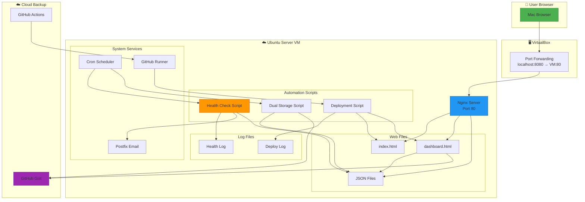
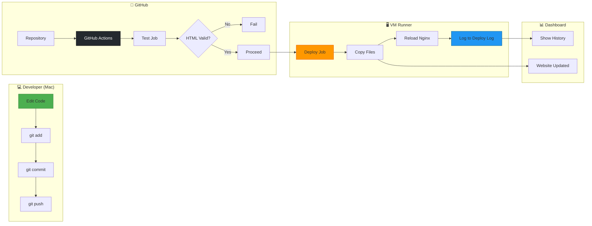
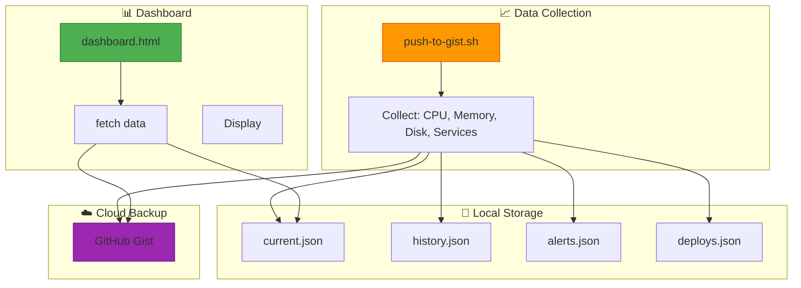
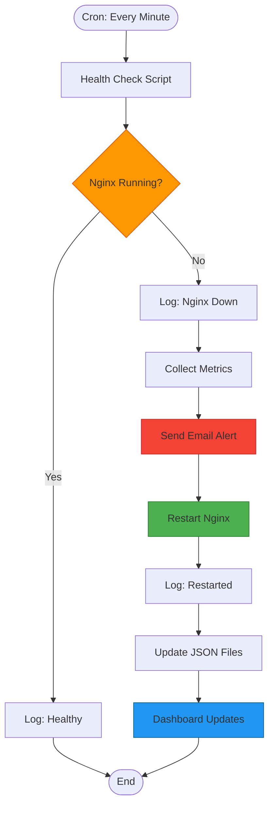

# 🛡️ Self-Healing Server

> A production-grade self-healing Linux server with automated recovery, real-time monitoring, and CI/CD pipeline.

---

## 📋 Table of Contents
- [Overview](#-overview)
- [Features](#-features)
- [Architecture](#-architecture)
- [CI/CD Pipeline](#-cicd-pipeline)
- [Data Flow](#-data-flow)
- [Self-Healing Mechanism](#-self-healing-mechanism)
- [Tech Stack](#-tech-stack)
- [Quick Start](#-quick-start)
- [Project Structure](#-project-structure)
- [Future Improvements](#-future-improvements)
- [License](#-license)


---
## 🎯 Overview

This project implements a **self-healing Linux server** that automatically detects and recovers from failures, sends real-time alerts, and provides a live monitoring dashboard. It's designed to minimize downtime and reduce manual intervention — exactly how modern cloud infrastructure operates.

### Key Capabilities

| Capability | Description |
|------------|-------------|
| 🔄 **Auto-restart** | Detects Nginx crashes within 60 seconds and restarts automatically |
| 📧 **Email alerts** | Sends detailed alerts with system metrics when failures occur |
| 🚀 **CI/CD pipeline** | Push to GitHub → auto-deploy to server via self-hosted runner |
| 📊 **Live dashboard** | Real-time metrics, historical graphs, crash alerts, deployment history |
| 💾 **Dual storage** | Local files for fast access + GitHub Gist backup for offline viewing |
| 🏗️ **Infrastructure as Code** | Single `setup.sh` script rebuilds entire server from scratch |

---

## ✨ Features

| Feature | Description |
|---------|-------------|
| **Self-Healing** | Monitors Nginx every minute, auto-restarts on failure |
| **Email Alerts** | Sends detailed email with CPU/Memory/Disk metrics when crash occurs |
| **CI/CD Pipeline** | Push to GitHub → auto-deploy to VM via self-hosted runner |
| **Live Dashboard** | Real-time metrics, historical graphs, crash alerts, deployment history, live logs |
| **Dual Storage** | Local files (fast) + GitHub Gist backup (offline access) |
| **Infrastructure as Code** | Single `setup.sh` script rebuilds entire server from scratch |

---
## 🏗️ Architecture

### System Overview


## 🔄 CI/CD Pipeline


## 📊 Data Flow


## ⚙️ Self-Healing Mechanism



## 🛠️ Tech Stack

| Category | Technology | Purpose |
|----------|------------|---------|
| **Operating System** | Ubuntu Server 24.04 | Base OS for VM |
| **Web Server** | Nginx | Serves website and dashboard |
| **Automation** | Bash Scripts | Self-healing, data collection, deployment |
| **Scheduling** | Cron | Runs health checks every minute |
| **CI/CD** | GitHub Actions + Self-hosted Runner | Automated deployments |
| **Email** | Postfix + Gmail SMTP | Alert notifications |
| **Frontend** | HTML/CSS/JS + Chart.js | Live monitoring dashboard |
| **Storage** | Local JSON + GitHub Gist | Dual storage for metrics |
| **Infrastructure as Code** | Bash (`setup.sh`) | One-command rebuild |
| **Virtualization** | VirtualBox | VM with NAT + port forwarding |

---
## 🚀 Quick Start

### Prerequisites
- VirtualBox installed on your Mac
- GitHub account
- Gmail account (for email alerts)

### One-Command Setup

```bash
# Clone the repository
git clone https://github.com/JhanaviR082/self-healing-server.git
cd self-healing-server

# Copy files to a fresh Ubuntu VM and run
./setup.sh
```

### Manual Verification

```bash
# SSH into your VM
ssh -p 2222 jhanavi@localhost

# Verify services
sudo systemctl status nginx
crontab -l
cd ~/actions-runner && sudo ./svc.sh status

# View live logs
tail -f /var/log/nginx-health.log
```

### Test Self-Healing

```bash
# Simulate a crash
sudo systemctl stop nginx

# Watch logs for recovery (within 60 seconds)
tail -f /var/log/nginx-health.log

# Check your email for alert
```

### Test CI/CD

```bash
# Make a change
echo "<!-- test -->" >> index.html

# Push to GitHub
git add index.html
git commit -m "Test deployment"
git push

# Watch dashboard for deployment history
```

---
## 📁 Project Structure

```
self-healing-server/
├── .github/workflows/
│   └── deploy.yml              # CI/CD pipeline
├── screenshots/                 # Documentation images
│   ├── dashboard-live.png
│   ├── dashboard-offline.png
│   ├── health-check-log.png
│   └── ...
├── dashboard.html              # Monitoring dashboard
├── index.html                  # Website
├── setup.sh                    # Infrastructure as Code
└── README.md                   # Documentation

Your VM (/var/www/html/)
├── index.html                  # Website (served)
├── dashboard.html              # Dashboard (served)
├── current.json                # Live metrics
├── history.json                # Historical data (500 points)
├── alerts.json                 # Crash alerts
└── deploys.json                # Deployment history

Your VM (/usr/local/bin/)
├── nginx-health-check.sh       # Self-healing script
├── push-to-gist.sh             # Dual storage script
└── deploy-from-github.sh       # Deployment script

Your VM (/var/log/)
├── nginx-health.log            # Health check logs
└── deploy.log                  # Deployment logs
```

---
## 🔮 Future Improvements

- [ ] **GitHub App Authentication** — Auto-renewing tokens (no expiration)
- [ ] **Multi-Server Support** — Monitor multiple VMs from one dashboard
- [ ] **Slack/Discord Integration** — Send alerts to chat
- [ ] **Prometheus Exporter** — Industry-standard metrics endpoint
- [ ] **Predictive Analytics** — AI-based failure prediction
- [ ] **Mobile App / PWA** — Installable dashboard on phone
- [ ] **Ansible Playbook** — Infrastructure as Code with Ansible

---

## 📄 License

This project is open source and available under the MIT License.

---
*Built to demonstrate DevOps, SRE, and Cloud Engineering skills.*
